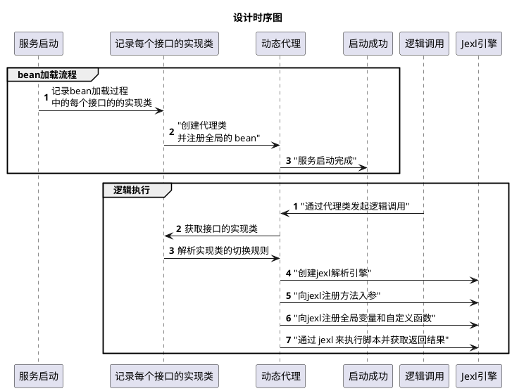

## 一、摘要

这是一个通过动态切换接口的实现类（springboot 中的 bean ），实现了一种高效而灵活的解决方案，用于应对复杂系统中的服务降级和功能灰度发布。

**该项目提出并实现了一种使用动态代理和配置中心来管理某个接口的多个业务实现，通过配置中心动态切换 Bean 的实现类，能够快速实现服务降级。
此外，借助 [JEXL](https://commons.apache.org/proper/commons-jexl/)  自定义方法的解析规则，项目还提供了一种小流量功能灰度发布的解决方案。**

## 二、相关工作 & 设计理念

**相关工作**

目前，社区中关于切换 Bean 实现类的实现仅有 [spring-smart-di](https://github.com/burukeYou/spring-smart-di) 这个仓库。
该实现完全基于项目配置，在服务启动时通过 BaseAutowiredBeanProcessor 根据配置内容为不同的 Bean 实例装配不同的实现类。
这意味着在服务启动后，无法动态修改 Bean 的实现类，存在一定的局限性。而且这个实现其实和spring `@Primary`注解的功能一致了。

**设计理念**

在日常的编码中，六大设计原则可谓深入人心，
在日常编码中，六大设计原则已深入人心。依赖倒置原则（Dependency Inversion Principle, DIP）和开闭原则（Open/Closed Principle, OCP）要求我们面向接口编程，
这样在编程过程中无需关注底层业务的具体实现，而是通过接口来定义流程中的逻辑执行和数据流转。
里氏替换原则（Liskov Substitution Principle, LSP）和接口隔离原则（Interface Segregation Principle, ISP）则要求我们确保流程中的任何接口实现都可以被替换，
且替换后程序行为不会发生变化。这些原则为我们的设计和实现提供了坚实的理论依据。

**实现原理**




## 三、高级用法-自定义全局变量和全局函数

> 待补充

## 四、服务降级 & 小流量灰度的示例

### 4.1、通过函数的调用方法来动态的切换 bean 实例，来达到小流量灰度的效果

> 当然，也可以当成某种策略模式来使用，因为就是可以按照参数来指定具体执行哪个实现类

例如，现在有一个短信发送服务，默认通过腾讯云的服务来发送短信，但是还有阿里云、京东云的备用渠道，定义如下：

```java
public interface SmsDispatchService {
    /**
     * Ways to send text messages.
     * @param dispatchContext SMS dispatch context, including SMS related information.
     * @return Whether the sending was successful.
     */
    Boolean dispatchMessage(DispatchContext dispatchContext);
}
```
下面给出我们可以通过请求参数中的`name`属性来小流量该次行为调用不同的供应商来发送短信的示例：

**通过腾讯云发送短信：**

```java
@Slf4j
// 通过注解的 primary 属性标注该实现为默认的短信发送渠道，当其他所有实现类的条件都不匹配是默认调用该渠道来发送
@SmartService(group = SmsDispatchService.class, primary = true)
public class TencentCloudSmsDispatchService implements SmsDispatchService {
    @Override
    @ConditionOnRule("args.dispatchContext.getName() == 'tencent'")
    public Boolean dispatchMessage(DispatchContext dispatchContext) {
        log.info("dispatchMessage by tencent cloud");
        dispatchContext.setReceipt(String.format("tencent-%s", new ObjectIdGenerator().next()));
        return true;
    }
}
```

**通过京东云发送短信：**
```java
@Slf4j
@SmartService(group = SmsDispatchService.class)
public class JdCloudSmsDispatchService implements SmsDispatchService {
    @Override
    @ConditionOnRule("args.dispatchContext.getName() == 'jd'")
    public Boolean dispatchMessage(DispatchContext dispatchContext) {
        log.info("dispatchMessage by jd cloud");
        dispatchContext.setReceipt(String.format("jd-%s", new ObjectIdGenerator().next()));
        return true;
    }
}
```

**通过阿里云发送短信：**

```java
@Slf4j
@SmartService(group = SmsDispatchService.class)
public class AlibabaCloudSmsDispatchService implements SmsDispatchService {
    @Override
    @ConditionOnRule("args.dispatchContext.getName() == 'ali'")
    public Boolean dispatchMessage(DispatchContext dispatchContext) {
        log.info("dispatchMessage by alibaba cloud");
        dispatchContext.setReceipt(String.format("alibaba-%s", new ObjectIdGenerator().next()));
        return true;
    }
}
```
**执行效果如下：**

```java
@Slf4j
@RunWith(SpringRunner.class)
@SpringBootTest(classes = TomcatLauncher.class, webEnvironment = SpringBootTest.WebEnvironment.DEFINED_PORT)
public class SmartFlowByMethodArgsTest {
    
    /**
     * The injected SMS delivery service instance is used to simulate SMS delivery in tests.
     */
    @Resource
    private SmsDispatchService smsDispatchService;

    @Test
    public void testSmallFlow() throws InterruptedException {

        // The input name parameter is ali, and the Alibaba Cloud interface is called to send text messages.
        DispatchContext context = new DispatchContext() {};
        context.setName("ali");
        Assert.assertTrue(smsDispatchService.dispatchMessage(context));
        Assert.assertTrue(context.getReceipt().startsWith("ali"));

        // The input name parameter is tencent, and the interface of Tencent Cloud is called to send text messages.
        context.setName("tencent");
        Assert.assertTrue(smsDispatchService.dispatchMessage(context));
        Assert.assertTrue(context.getReceipt().startsWith("tencent"));

        // The input name parameter is jd, and the interface of JD Cloud is called to send text messages.
        context.setName("jd");
        Assert.assertTrue(smsDispatchService.dispatchMessage(context));
        Assert.assertTrue(context.getReceipt().startsWith("jd"));

        // The input name parameter is other, and the default main bean implementation is called to send text messages.
        context.setName("other");
        Assert.assertTrue(smsDispatchService.dispatchMessage(context));
        Assert.assertTrue(context.getReceipt().startsWith("tencent"));

        // test the getOriginTarget method implemented by the proxy class
        Assert.assertTrue(smsDispatchService instanceof Advised);
        Assert.assertNotNull(((Advised) smsDispatchService).getOriginTarget());

        // test the toString method implemented by the proxy class
        Assert.assertTrue(smsDispatchService.toString().contains("SDI"));
        log.info("hello");
    }
}
```

### 4.2、通过切换配置快速切换服务中的 bean 的实现类来实现服务降级

例如，现在有一个广告系统，需要根据用户的输入来通过向量召回来为用户推荐内容，

当单节点 qps 过高时，为了防止推荐模型被大流量打崩，所以当 qps 超过超过 1000 时，触发降级服务。示例如下：

**首先定义一个召回服务接口：**

```java
/**
 * Define a standard interface for material recall services
 */
public interface MaterialRecallService {

    /**
     * List of recalled materials
     */
    RecallResult recall(RecallContext context);
}
```

**实现这个接口**

```java

@ConditionOnRule("global.qps <= 1000")
@SmartService(group = MaterialRecallService.class)
public class MaterialVectorRecallServiceImpl implements MaterialRecallService {

    @Override
    public RecallResult recall(RecallContext context) {
        return RecallResult.builder().receipt("normal, qps <= 1000").build();
    }
}
```

qps 过高以后基于数据库、es 等排序的降级方案。（这里只是举例， 不讨论具体两个方案的性能优劣）

```java
// 默认的使用向量召回的方案。
@ConditionOnRule("global.qps > 1000")
@SmartService(group = MaterialRecallService.class, primary = true)
public class DegradeSortByDbMaterialRecallServiceImpl implements MaterialRecallService {

    @Override
    public RecallResult recall(RecallContext context) {
        return RecallResult.builder().receipt("degrade，qps > 1000").build();
    }
}
```

**执行效果如下：**

```java
@Slf4j
@RunWith(SpringRunner.class)
@SpringBootTest(classes = TomcatLauncher.class, webEnvironment = SpringBootTest.WebEnvironment.DEFINED_PORT)
public class DegradeByGlobalConfigTest {

    /**
     * Material recall service instance, used to execute related business logic.
     */
    @Resource
    private MaterialRecallService materialRecallService;

    /**
     * Global intelligent IOC context instance, used to obtain and manage global configuration information.
     */
    @Resource
    private GlobalSmartIocContext globalSmartIocContext;

    @Test
    public void degradeTest() {
        // Tests if qps <= 1000 normally uses the normal vector recall implementation to return recommended content
        globalSmartIocContext.registerGlobalVar("qps", 1);
        RecallResult result = materialRecallService.recall(new RecallContext());
        Assert.assertNotNull(result);
        Assert.assertEquals("normal, qps <= 1000", result.getReceipt());

        // Test the critical condition judgment under normal circumstances, and execute the normal vector recall strategy when qps <= 1000
        globalSmartIocContext.registerGlobalVar("qps", 1000);
        result = materialRecallService.recall(new RecallContext());
        Assert.assertNotNull(result);
        Assert.assertEquals("normal, qps <= 1000", result.getReceipt());

        // Test whether to execute the downgrade plan when qps is greater than 1000
        globalSmartIocContext.registerGlobalVar("qps", 2000);
        result = materialRecallService.recall(new RecallContext());
        Assert.assertNotNull(result);
        Assert.assertEquals("degrade，qps > 1000", result.getReceipt());

        // Test whether to execute the downgrade plan when qps is greater than 1000
        globalSmartIocContext.registerGlobalVar("qps", 1001);
        result = materialRecallService.recall(new RecallContext());
        Assert.assertNotNull(result);
        Assert.assertEquals("degrade，qps > 1000", result.getReceipt());
    }
}
```