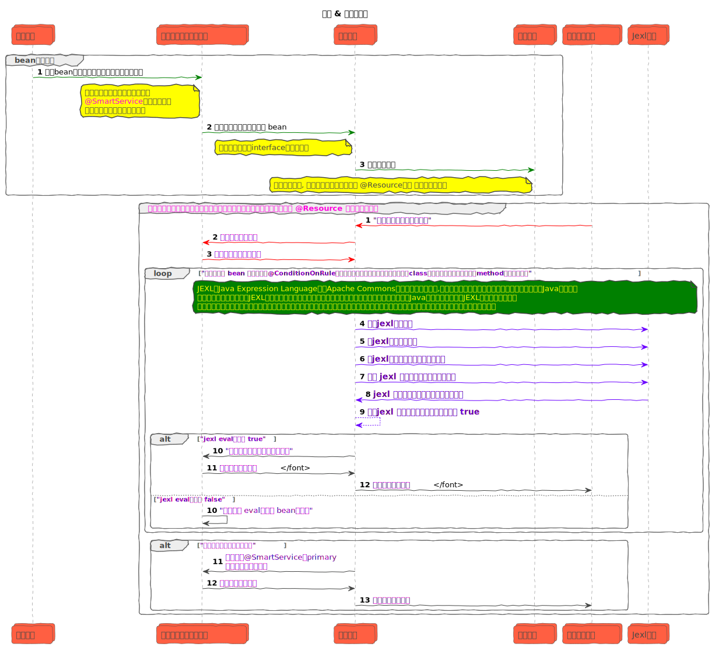

## 一、说在前面的话

本项目描述并实现了一种基于动态代理与配置中心切换 bean 的实现类来达到服务降级与流量灰度发布方法的研究。

这是一个通过动态切换接口的实现类（springboot 中的 bean ），实现了一种高效而灵活的解决方案，用于应对复杂系统中的服务降级和功能灰度发布。

**该项目提出并实现了一种使用动态代理和配置中心来管理某个接口的多个业务实现，通过动态切换 Bean 的实现类快速实现服务降级。
此外，借助 [JEXL](https://commons.apache.org/proper/commons-jexl/)  自定义方法的解析规则，还提供了一种小流量功能灰度发布的解决方案。**

## 二、相关工作 & 设计理念

**相关工作**

目前，社区中关于切换 Bean 实现类的实现仅有 [spring-smart-di](https://github.com/burukeYou/spring-smart-di) 这个仓库。
该实现完全基于项目配置，在服务启动时通过 BaseAutowiredBeanProcessor 根据配置内容为不同的 Bean 实例装配不同的实现类。
这意味着在服务启动后，无法动态修改 Bean 的实现类，存在一定的局限性。而且这个实现其实和spring `@Primary`注解的功能一致了。

**设计理念**

在日常编码中，六大设计原则已深入人心。依赖倒置原则（Dependency Inversion Principle, DIP）和开闭原则（Open/Closed Principle,
OCP）要求我们面向接口编程，
这样在编程过程中无需关注底层业务的具体实现，而是通过接口来定义流程中的逻辑执行和数据流转。
里氏替换原则（Liskov Substitution Principle, LSP）和接口隔离原则（Interface Segregation Principle,
ISP）则要求我们确保流程中的任何接口实现都可以被替换，
且替换后程序行为不会发生变化。这些原则为我们的设计和实现提供了坚实的理论依据。

**实现原理**

实现原理其实很简单，通过代理类来执行规则判定即可，通过时序图描述的逻辑如下：




你可以像这样子引入他：

```xml
<dependency>
    <groupId>plus.jdk</groupId>
    <artifactId>spring-smart-ioc-starter</artifactId>
    <version>1.0.2</version>
</dependency>
```

## 三、高级用法-自定义全局变量和全局函数

组件中提供了一个 bean ```GlobalSmartIocContext#registerGlobalVar(name, obj)``` 来注册全局的变量的功能，示例如下：

> 注意, 这个registerGlobalVar是全局的，会存在堆空间里面, 本质上其实对应 bean 实例里面的一个`ConcurrentHashMap`
> ，后续每次执行方法或类的
> condition rule的时候，都会把全局变量注册到 jexl 的 global 属性中，当然，你也可以写入一个工具类进来执行函数调用，但是这里不建议执行过于复杂的逻辑。
> 并且这里出于安全考虑，不允许写入的脚本执行任何具有副作用（例如篡改全局变量或函数入参、执行循环调用等）的逻辑，仅允许执行简单的判定表达式

**`@ConditionOnRule`执行 eval逻辑时运行环境中的一些魔法变量的说明**

| 变量名     | 说明                                                                                          | 补充                                                                                                                                                                                                                                 |
|---------|---------------------------------------------------------------------------------------------|------------------------------------------------------------------------------------------------------------------------------------------------------------------------------------------------------------------------------------|
| args    | 当前调用的方法的入参, 允许在condition rule里面使用函数入参判定是否调用该实现类的方法，这个参数每次执行方法调用的时候都会作为临时变量写入运行环境            | 例如，你的方法定义为```String greeting(String name, String sex);```, 那么你可以在 condition rule里面通过 `args.name` 或 `args.sex` 来访问被调用的方法(Method)的入参                                                                                                 |
| global  | 全局的变量或工具类                                                                                   | 你可以使用 `global` 在condition rule中访问你写入的全局变量或一些工具类，例如，当你使用 `globalSmartIocContext.registerGlobalVar("random", new Random()))`注册`random`后，可以使用这样子的表达式 `@ConditionOnRule("global.random.nextInt(100) % 10 >= 8")`来将 20% 的流量来打到当前的这个实现类上 |
| current | 允许在 condition rule 维度来访问当前的 beanName(`current.beanName`) 和 methodName(`current.methodName`) | 这里你可以通过监听配置中心使用 `@ConditionOnRule("current.beanName == global.myServiceName")` 来指定当前要切换为哪个实现类. 这里的 `myServiceName`可以通过 `GlobalSmartIocContext#registerGlobalVar(name, obj)`写入                                                      |

**写入全局变量：**

```java
import java.util.Random;

public class SetGlobalConfigTest {

    /**
     * Material recall service instance, used to execute related business logic.
     */
    @Resource
    private MaterialRecallService materialRecallService;

    /**
     * Global intelligent IOC context instance, used to obtain and manage global configuration information.
     */
    @Resource
    private GlobalSmartIocContext globalSmartIocContext;

    @Test
    public void degradeTest() {
        // Tests if qps <= 1000 normally uses the normal vector recall implementation to return recommended content
        globalSmartIocContext.registerGlobalVar("qps", 1);
        globalSmartIocContext.registerGlobalVar("random", new Random());
    }
}
```
接下来你可以通过`global`变量来访问这里注册的全局变量和全局函数.例如, 你可以像下面这样，指定当 qps 小于 2000 时利用注册的 random 函数将 20% 的流量打到这个实现上：

```java
import plus.jdk.smart.ioc.annotations.SmartService;

@ConditionOnRule("global.qps < 2000 && random.nextInt(100) % 10 > 8")
@SmartService(group = MyService.class)
public class QpsDegradeService implements MyService {
    // do something
}
```
**最后的魔法**

思虑再三，虽然这样子一来会有一些安全性的问题，但是这完全取决于使用者了，不应该舍本逐末。
最后登场的魔法就是全局`jexl.eval(anyString())`函数了，这个函数允许你直接通过全局变量自定义脚本。
> 当然了，你也可以是用局部变量来传递脚本来执行，但是注意，这是非常不安全的一种做法，因为函数的输入大多来自外部输入，
> 如果你把这个功能开放给外部输入，那你最好保证调用方是可信的，值得你去给他最高级别的执行权限！！！否则就不要这么做。
> 甚至于，在上述功能足够满足你需求的情况下，尽量不要使用这个魔法函数，这里只是为了满足一些上述功能不能满足需求的场景

通过这个功能，你可以把你想要执行的脚本配置在 配置中心 中，当服务启动或配置变化时，通过如下指令来更新你的脚本到 `global` 对象中:

```java
public class SmartIocSelectorFactoryTest {

    /**
     * Global intelligent IOC context instance, used to obtain and manage global configuration information.
     */
    @Resource
    private GlobalSmartIocContext globalSmartIocContext;

    @Test
    public void evalExpressionTest() {
        // Test the magic jexl.eval() function
        globalSmartIocContext.registerGlobalVar("testScript", "1 + 2");
    }
}
```

然后使用 `@ConditionOnRule("jexl.eval(global.testScript)")`配置在需要的类或者方法上即可。通过这个魔法方法你可以把你的切换规则放在配置中心，通过配置中心按需求动态下发即可！！！

> 注意, 使用函数输入时，千万不要把 `args` 的成员变量的内容传递给`jexl.eval(anyString())`函数，这会导致你的入参变成可执行的脚本！！！比如你的函数入参分别为 `a=3`、`b=4`,
> 你可以这么写`@ConditionOnRule("jexl.eval(global.testScript) > args.a + args.b")`, 这是安全的; 但是如果你直接把 args的参数内容直接传递给`jexl.eval(anyString())`，
> 例如 `@ConditionOnRule("jexl.eval(args.b)")。

所以，我的朋友，你是一个合格的开发者了，但是我还是得提醒你，<p style="color: red; ">__永远都不要把入参直接当做脚本执行，这不管在哪都是一样的， 
就像[变基的风险](https://git-scm.com/book/zh/v2/Git-%E5%88%86%E6%94%AF-%E5%8F%98%E5%9F%BA.html#_rebase_peril)中提交到的，
如果你遵循这条金科玉律，就不会出差错。否则人民群众会仇恨你，你的朋友和家人也会嘲笑你，唾弃你!!!__<p>

## 四、服务降级 & 小流量灰度的示例

### 4.1、通过函数的调用方法来动态的切换 bean 实例，来达到小流量灰度的效果

> 当然，也可以当成某种策略模式来使用，因为就是可以按照参数来指定具体执行哪个实现类

例如，现在有一个短信发送服务，默认通过腾讯云的服务来发送短信，但是还有阿里云、京东云的备用渠道，定义如下：

```java
public interface SmsDispatchService {
    /**
     * Ways to send text messages.
     * @param dispatchContext SMS dispatch context, including SMS related information.
     * @return Whether the sending was successful.
     */
    Boolean dispatchMessage(DispatchContext dispatchContext);
}
```

下面给出我们可以通过请求参数中的`name`属性来小流量该次行为调用不同的供应商来发送短信的示例：

**通过腾讯云发送短信：**

```java

@Slf4j
// 通过注解的 primary 属性标注该实现为默认的短信发送渠道，当其他所有实现类的条件都不匹配是默认调用该渠道来发送
@SmartService(group = SmsDispatchService.class, primary = true)
public class TencentCloudSmsDispatchService implements SmsDispatchService {
    @Override
    @ConditionOnRule("args.dispatchContext.getName() == 'tencent'")
    public Boolean dispatchMessage(DispatchContext dispatchContext) {
        log.info("dispatchMessage by tencent cloud");
        dispatchContext.setReceipt(String.format("tencent-%s", new ObjectIdGenerator().next()));
        return true;
    }
}
```

**通过京东云发送短信：**

```java

@Slf4j
@SmartService(group = SmsDispatchService.class)
public class JdCloudSmsDispatchService implements SmsDispatchService {
    @Override
    @ConditionOnRule("args.dispatchContext.getName() == 'jd'")
    public Boolean dispatchMessage(DispatchContext dispatchContext) {
        log.info("dispatchMessage by jd cloud");
        dispatchContext.setReceipt(String.format("jd-%s", new ObjectIdGenerator().next()));
        return true;
    }
}
```

**通过阿里云发送短信：**

```java

@Slf4j
@SmartService(group = SmsDispatchService.class)
public class AlibabaCloudSmsDispatchService implements SmsDispatchService {
    @Override
    @ConditionOnRule("args.dispatchContext.getName() == 'ali'")
    public Boolean dispatchMessage(DispatchContext dispatchContext) {
        log.info("dispatchMessage by alibaba cloud");
        dispatchContext.setReceipt(String.format("alibaba-%s", new ObjectIdGenerator().next()));
        return true;
    }
}
```

**执行效果如下：**

```java

@Slf4j
@RunWith(SpringRunner.class)
@SpringBootTest(classes = TomcatLauncher.class, webEnvironment = SpringBootTest.WebEnvironment.DEFINED_PORT)
public class SmartFlowByMethodArgsTest {

    /**
     * The injected SMS delivery service instance is used to simulate SMS delivery in tests.
     */
    @Resource
    private SmsDispatchService smsDispatchService;

    @Test
    public void testSmallFlow() throws InterruptedException {

        // The input name parameter is ali, and the Alibaba Cloud interface is called to send text messages.
        DispatchContext context = new DispatchContext() {
        };
        context.setName("ali");
        Assert.assertTrue(smsDispatchService.dispatchMessage(context));
        Assert.assertTrue(context.getReceipt().startsWith("ali"));

        // The input name parameter is tencent, and the interface of Tencent Cloud is called to send text messages.
        context.setName("tencent");
        Assert.assertTrue(smsDispatchService.dispatchMessage(context));
        Assert.assertTrue(context.getReceipt().startsWith("tencent"));

        // The input name parameter is jd, and the interface of JD Cloud is called to send text messages.
        context.setName("jd");
        Assert.assertTrue(smsDispatchService.dispatchMessage(context));
        Assert.assertTrue(context.getReceipt().startsWith("jd"));

        // The input name parameter is other, and the default main bean implementation is called to send text messages.
        context.setName("other");
        Assert.assertTrue(smsDispatchService.dispatchMessage(context));
        Assert.assertTrue(context.getReceipt().startsWith("tencent"));

        // test the getOriginTarget method implemented by the proxy class
        Assert.assertTrue(smsDispatchService instanceof Advised);
        Assert.assertNotNull(((Advised) smsDispatchService).getOriginTarget());

        // test the toString method implemented by the proxy class
        Assert.assertTrue(smsDispatchService.toString().contains("SDI"));
        log.info("hello");
    }
}
```

### 4.2、通过切换配置快速切换服务中的 bean 的实现类来实现服务降级

例如，现在有一个广告系统，需要根据用户的输入来通过向量召回来为用户推荐内容，

当单节点 qps 过高时，为了防止推荐模型被大流量打崩，所以当 qps 超过超过 1000 时，触发降级服务。示例如下：

**首先定义一个召回服务接口：**

```java
/**
 * Define a standard interface for material recall services
 */
public interface MaterialRecallService {

    /**
     * List of recalled materials
     */
    RecallResult recall(RecallContext context);
}
```

**实现这个接口**

```java

@ConditionOnRule("global.qps <= 1000")
@SmartService(group = MaterialRecallService.class)
public class MaterialVectorRecallServiceImpl implements MaterialRecallService {

    @Override
    public RecallResult recall(RecallContext context) {
        return RecallResult.builder().receipt("normal, qps <= 1000").build();
    }
}
```

qps 过高以后基于数据库、es 等排序的降级方案。（这里只是举例， 不讨论具体两个方案的性能优劣）

```java
// 默认的使用向量召回的方案。
@ConditionOnRule("global.qps > 1000")
@SmartService(group = MaterialRecallService.class, primary = true)
public class DegradeSortByDbMaterialRecallServiceImpl implements MaterialRecallService {

    @Override
    public RecallResult recall(RecallContext context) {
        return RecallResult.builder().receipt("degrade，qps > 1000").build();
    }
}
```

**执行效果如下：**

```java

@Slf4j
@RunWith(SpringRunner.class)
@SpringBootTest(classes = TomcatLauncher.class, webEnvironment = SpringBootTest.WebEnvironment.DEFINED_PORT)
public class DegradeByGlobalConfigTest {

    /**
     * Material recall service instance, used to execute related business logic.
     */
    @Resource
    private MaterialRecallService materialRecallService;

    /**
     * Global intelligent IOC context instance, used to obtain and manage global configuration information.
     */
    @Resource
    private GlobalSmartIocContext globalSmartIocContext;

    @Test
    public void degradeTest() {
        // Tests if qps <= 1000 normally uses the normal vector recall implementation to return recommended content
        globalSmartIocContext.registerGlobalVar("qps", 1);
        RecallResult result = materialRecallService.recall(new RecallContext());
        Assert.assertNotNull(result);
        Assert.assertEquals("normal, qps <= 1000", result.getReceipt());

        // Test the critical condition judgment under normal circumstances, and execute the normal vector recall strategy when qps <= 1000
        globalSmartIocContext.registerGlobalVar("qps", 1000);
        result = materialRecallService.recall(new RecallContext());
        Assert.assertNotNull(result);
        Assert.assertEquals("normal, qps <= 1000", result.getReceipt());

        // Test whether to execute the downgrade plan when qps is greater than 1000
        globalSmartIocContext.registerGlobalVar("qps", 2000);
        result = materialRecallService.recall(new RecallContext());
        Assert.assertNotNull(result);
        Assert.assertEquals("degrade，qps > 1000", result.getReceipt());

        // Test whether to execute the downgrade plan when qps is greater than 1000
        globalSmartIocContext.registerGlobalVar("qps", 1001);
        result = materialRecallService.recall(new RecallContext());
        Assert.assertNotNull(result);
        Assert.assertEquals("degrade，qps > 1000", result.getReceipt());
    }
}
```