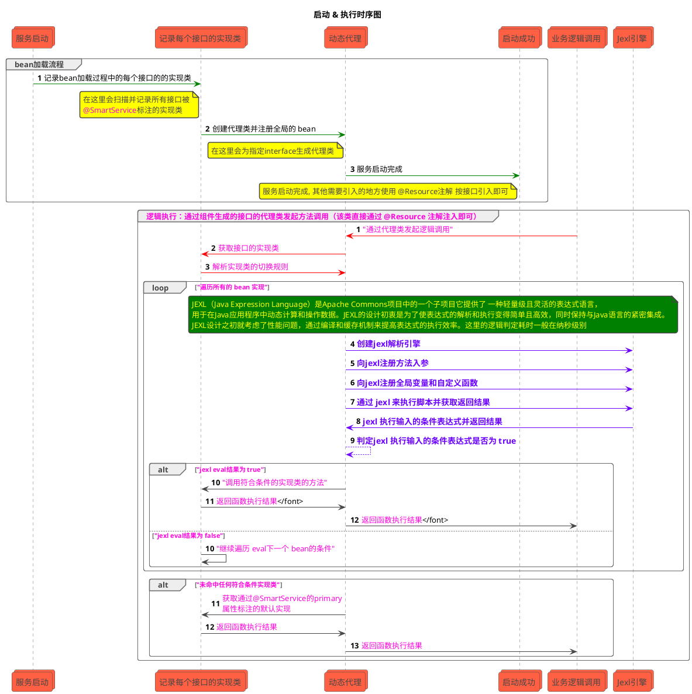

```plantuml
`:execution-sequence-diagram
@startuml
title 启动 & 执行时序图
!theme vibrant

!define purple_color 6A00FF
!define green_color green
!define red_color FF05DE
!define yellow_color yellow
!define STRONG_TEXT(text) <b>text</b>
!define PURPLE_TEXT(text) <font color="purple_color" size=14><b>text</b></font>
!define GREEN_TEXT(text) <font color="green_color" size=14><b>text</b></font>
!define BLUE_TEXT(text) <font color="blue">text</font>
!define GREEN_TEXT(text) <font color="green_color"">text</font>
!define RED_TEXT(text) <font color="red_color">text</font>
!define YELLOW_TEXT(text) <font color="yellow_color">text</font>
!define record_impl_msg GREEN_TEXT("记录bean加载过程中的每个接口的的实现类")
!define create_proxy_msg GREEN_TEXT("创建代理类并注册全局的 bean")
!define create_proxy_msg_note GREEN_TEXT("在这里会为指定interface生成代理类")
!define start_success_msg GREEN_TEXT("服务启动完成")
!define start_success_msg_note GREEN_TEXT("服务启动完成, 其他需要引入的地方使用 @Resource注解 按接口引入即可")
!define bean_load_flow GREEN_TEXT("bean加载流程")
!define logic_exec_group_name RED_TEXT(逻辑执行：通过组件生成的接口的代理类发起方法调用（该类直接通过 @Resource 注解注入即可）)
!define logic_exec_msg "通过代理类发起逻辑调用"
!define get_impl_msg 获取接口的实现类
!define parse_condition_rule 解析实现类的切换规则
!define jexl_engine_create_msg PURPLE_TEXT("创建jexl解析引擎")
!define jexl_engine_context_msg PURPLE_TEXT("向jexl注册方法入参")
!define jexl_engine_context_reg_msg PURPLE_TEXT("向jexl注册全局变量和自定义函数")
!define jexl_engine_eval_msg PURPLE_TEXT("通过 jexl 来执行脚本并获取返回结果")
!define jexl_engine_eval_result PURPLE_TEXT("jexl 执行输入的条件表达式并返回结果")
!define jexl_engine_eval_condition PURPLE_TEXT("判定jexl 执行输入的条件表达式是否为 true")
!define loop_bean_impl_msg "遍历所有的 bean 实现"
!define script_eval_true_msg "jexl eval结果为 true"
!define script_eval_false_msg "jexl eval结果为 false"
!define script_eval_false_continue_msg "继续遍历 eval下一个 bean的条件"
!define bean_impl_invoke_method_msg "调用符合条件的实现类的方法"
!define bean_impl_invoke_method_return_msg RED_TEXT("返回函数执行结果")
!define no_matching_rules_were_hit "未命中任何符合条件实现类"
!define get_default_implementation_annotated_via_primary_msg RED_TEXT(获取通过@SmartService的primary)\nRED_TEXT(属性标注的默认实现)
!define bean_load_flow_note GREEN_TEXT(在这里会扫描并记录所有接口被)\nRED_TEXT("@SmartService")GREEN_TEXT( 标注的实现类)
!define jexl_desc_note_line1 YELLOW_TEXT(JEXL（Java Expression Language）是Apache Commons项目中的一个子项目它提供了 一种轻量级且灵活的表达式语言，) 
!define jexl_desc_note_line2 YELLOW_TEXT(用于在Java应用程序中动态计算和操作数据。JEXL的设计初衷是为了使表达式的解析和执行变得简单且高效，同时保持与Java语言的紧密集成。)
!define jexl_desc_note_line3 YELLOW_TEXT(JEXL设计之初就考虑了性能问题，通过编译和缓存机制来提高表达式的执行效率。这里的逻辑判定耗时一般在纳秒级别)


collections 服务启动 as service_start
collections 记录每个接口的实现类 as record_impl
collections 动态代理 as proxy_bean
collections 启动成功 as start_success
collections 业务逻辑调用 as logic_exec
collections Jexl引擎 as jexl_engine

group bean_load_flow
    autonumber
    service_start -[#green]> record_impl : record_impl_msg
    note left record_impl #yellow:bean_load_flow_note
    record_impl -[#green]> proxy_bean: create_proxy_msg
    note left proxy_bean #yellow: create_proxy_msg_note
    proxy_bean -[#green]> start_success:start_success_msg
    note left start_success #yellow:start_success_msg_note
end

group logic_exec_group_name
    autonumber
    logic_exec -[#red]> proxy_bean:RED_TEXT(logic_exec_msg)
    proxy_bean -[#red]> record_impl:RED_TEXT(get_impl_msg)
    record_impl -[#red]> proxy_bean: RED_TEXT(parse_condition_rule)
    loop STRONG_TEXT(RED_TEXT(loop_bean_impl_msg))
        note over proxy_bean,start_success #green
            jexl_desc_note_line1
            jexl_desc_note_line2
            jexl_desc_note_line3
        end note
        proxy_bean -[#purple_color]> jexl_engine: jexl_engine_create_msg
        proxy_bean -[#purple_color]> jexl_engine: jexl_engine_context_msg
        proxy_bean -[#purple_color]> jexl_engine: jexl_engine_context_reg_msg
        proxy_bean -[#purple_color]> jexl_engine: jexl_engine_eval_msg
        jexl_engine -[#purple_color]> proxy_bean: jexl_engine_eval_result
        proxy_bean --[#purple_color]> proxy_bean: jexl_engine_eval_condition
        alt RED_TEXT(script_eval_true_msg)
            autonumber 10
            proxy_bean -> record_impl: RED_TEXT(bean_impl_invoke_method_msg)
            record_impl -> proxy_bean: RED_TEXT(bean_impl_invoke_method_return_msg)
            proxy_bean -> logic_exec: RED_TEXT(bean_impl_invoke_method_return_msg)
        else RED_TEXT(script_eval_false_msg)
            autonumber 10
            record_impl -> record_impl: RED_TEXT(script_eval_false_continue_msg)
        end
    end
    alt RED_TEXT(no_matching_rules_were_hit)
        autonumber 11
        proxy_bean -> record_impl:get_default_implementation_annotated_via_primary_msg
        record_impl -> proxy_bean: bean_impl_invoke_method_return_msg
        proxy_bean -> logic_exec: bean_impl_invoke_method_return_msg
    end
end
@enduml
```
