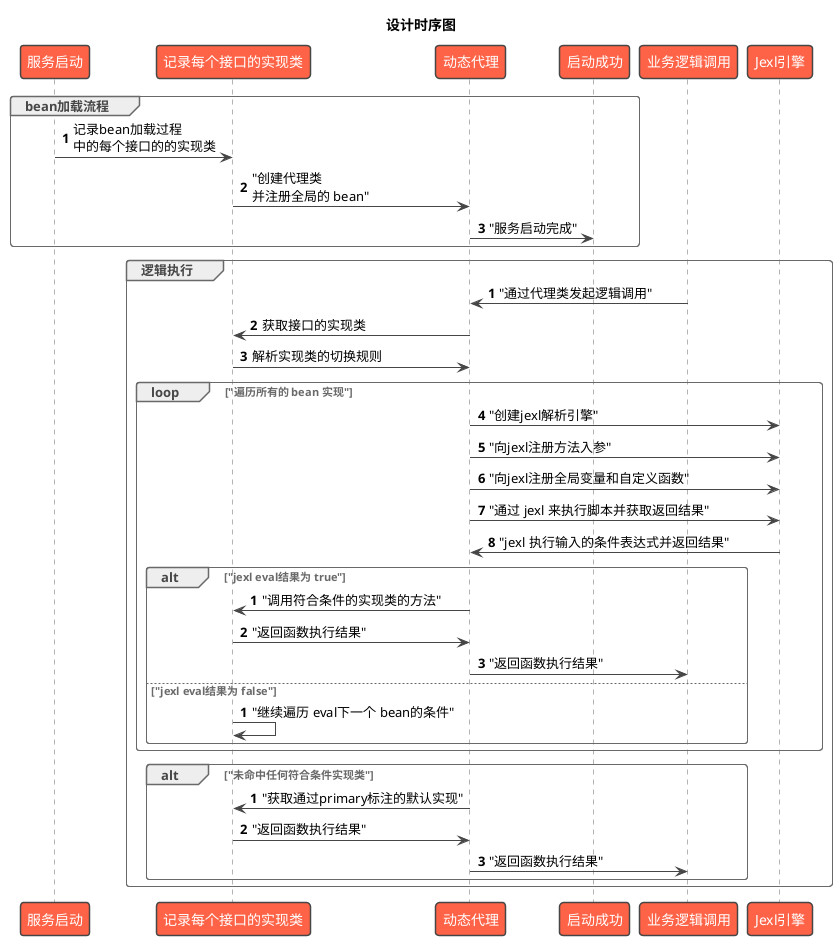

```plantuml
@startuml
title 设计时序图
!theme vibrant
!define service_start 服务启动
!define record_impl "记录每个接口的实现类"
!define record_impl_msg 记录bean加载过程\n中的每个接口的的实现类
!define proxy_bean "动态代理"
!define create_proxy_msg "创建代理类\n并注册全局的 bean"
!define start_success "启动成功"
!define start_success_msg "服务启动完成"
!define bean_load_flow bean加载流程
!define logic_exec_group_name 逻辑执行
!define logic_exec "业务逻辑调用"
!define logic_exec_msg "通过代理类发起逻辑调用"
!define get_impl_msg 获取接口的实现类
!define parse_condition_rule 解析实现类的切换规则
!define jexl_engine "Jexl引擎"
!define jexl_engine_create_msg "创建jexl解析引擎"
!define jexl_engine_context_msg "向jexl注册方法入参"
!define jexl_engine_context_reg_msg "向jexl注册全局变量和自定义函数"
!define jexl_engine_eval_msg "通过 jexl 来执行脚本并获取返回结果"
!define jexl_engine_eval_result "jexl 执行输入的条件表达式并返回结果"
!define loop_bean_impl_msg "遍历所有的 bean 实现"
!define script_eval_true_msg "jexl eval结果为 true"
!define script_eval_false_msg "jexl eval结果为 false"
!define script_eval_false_continue_msg "继续遍历 eval下一个 bean的条件"
!define bean_impl_invoke_method_msg "调用符合条件的实现类的方法"
!define bean_impl_invoke_method_return_msg "返回函数执行结果"
!define no_matching_rules_were_hit "未命中任何符合条件实现类"
!define get_default_implementation_annotated_via_primary_msg "获取通过primary标注的默认实现"

group bean_load_flow
    autonumber
    service_start -> record_impl : record_impl_msg
    record_impl -> proxy_bean: create_proxy_msg
    proxy_bean -> start_success:start_success_msg
end

group logic_exec_group_name
    autonumber
    logic_exec -> proxy_bean:logic_exec_msg
    proxy_bean -> record_impl:get_impl_msg
    record_impl -> proxy_bean: parse_condition_rule
    loop loop_bean_impl_msg
        proxy_bean -> jexl_engine: jexl_engine_create_msg
        proxy_bean -> jexl_engine: jexl_engine_context_msg
        proxy_bean -> jexl_engine: jexl_engine_context_reg_msg
        proxy_bean -> jexl_engine: jexl_engine_eval_msg
        jexl_engine -> proxy_bean: jexl_engine_eval_result
        alt script_eval_true_msg
            autonumber
            proxy_bean -> record_impl: bean_impl_invoke_method_msg
            record_impl -> proxy_bean: bean_impl_invoke_method_return_msg
            proxy_bean -> logic_exec: bean_impl_invoke_method_return_msg
        else script_eval_false_msg
            autonumber
            record_impl -> record_impl: script_eval_false_continue_msg
        end
    end
    alt no_matching_rules_were_hit
        autonumber
        proxy_bean -> record_impl:get_default_implementation_annotated_via_primary_msg
        record_impl -> proxy_bean: bean_impl_invoke_method_return_msg
        proxy_bean -> logic_exec: bean_impl_invoke_method_return_msg
    end
end
@enduml
```
